# Microhack : Using Azure FrontDoor to expose Workloads to the Internet

# Contents

[About Microhacks](#about-microhacks)

[Overview](#overview)

[Environment](#environment)

[Create Environment](#create-environment)

[About Let's Encrypt](#about-lets-encrypt)

[Module 0 : Check the environment](#module-0--check-the-environment)

[Module 1 : Explore FrontDoor backend options](#module-1--explore-frontdoor-backend-pool-options)

[Module 2 : Explore FrontDoor routing rules](#module-2--explore-frontdoor-routing-rules)

[Module 3 : (optional) Add your own domain](#module-3--optional-add-your-own-domain)

[Module 4 : Performance between FrontDoor and direct connectivity](#module-4--performance-between-frontdoor-and-direct-connectivity)

[Module 5 : Rules Engine](#module-5--rules-engine)

[Closing : Clean up resources](#closing--clean-up-resources)

**Work in progress / coming soon:**

*Module x : Monitoring Azure FrontDoor*  
*Module x : Azure FrontDoor Premium*  
*Module x : Accessing FrontDoor via IPv6*  
*Module x : Test failover of backend member*  
*Module x : Integrate public / private certs with private link backend*
*Module x : Test WAF in Azure FrontDoor*
*Additional information*  
*Adopt the environment to your needs*

---


## About Microhacks
Microhacks are a great way to explore a certain topic in a short amount of time. They're purpose build and help you to get a basic understanding of a service without overwhelming you with the complexity of the documentation. Instead you're going to use a pre-build environment to learn and gather your own findings.
This pre-build environment is also useful if you want to test something or need to build a lab environment.

Besides this Microhack, there are a couple of others available:

- Azure Virtual WAN https://github.com/mddazure/azure-vwan-microhack
- Azure Private Link https://github.com/adstuart/azure-privatelink-dns-microhack

## Overview
In this Microhack you're going to learn about the different options in Azure FrontDoor and how it can help to deliver high available and secure Applications to the Internet.
Beginning with a Standard FrontDoor instance, you're going to learn about the different backend options, explore request routing in Azure FD and see the rules engine in action.

Moving on, you'll create an Azure FrontDoor Premium and deploy a backend connected via private link (this feature ist still in preview but quite interesting for many scenarios).

## Environment
Since deployment of the necessary resources takes some time, many parts of the lab enviroment are scripted and deployment can be done via terraform.


### Backends
FrontDoor is a global service and can forward requests to backends based on different algorithms.
To see the different options, we're going to deploy storage accounts, containing static website content and webservers in different regions.

If you're using the supplied scripts, backends will be deployed in:

- West Europe (WEU)
- US Central (USC)
- SouthEast Asia (SEA)


### Clients
To simulate access from different regions, we'll deploy VMs in three different regions. These VMs will be used to connect to Azure FrontDoor and to observe how Azure FrontDoor handles requests from different regions. The client VMs will be deployed in the same regions as the backends are deployed.

The clients are based on Windows Server 2019.


Clients can be accessed via RDP or Azure Bastion. The terraform script automatically added the client IP address from the deployment environment to the allowed RDP hosts in the Network Security Group.

Ensure that your client IP-Address is added and that your firewall allows port 3389 (RDP) outbound. If not, please use Azure Bastion.


## Create Environment
When you're using your local environment, be sure that you have the latest versions of AZ-CLI, a git client and terraform installed.
For now, I'm going to assume that you'll be using [Azure Cloud Shell](https://docs.microsoft.com/en-us/azure/cloud-shell/overview)

- Log in to Azure Cloud Shell at https://shell.azure.com/ and select Bash
  
- (on your local environemnt) Ensure Azure CLI and extensions are up to date:
    ```console
  az upgrade --yes
  ```  
- Verify you're using the right subscription:
  ```console
  az account list -o table | grep True
  ```
- If not, change to the suscription you want to use for the deployment:
  ```console
  az account set --subscription <Name or ID of subscription>
  ```
  
- Clone this github repository. Go to the local directory where the github repo shall be cloned to and issue:
  ```console
  git clone https://github.com/gbuchmsft/Azure-FrontDoor-MicroHack.git
  ```

- Change directory:
  ```console
  cd ./Azure-FrontDoor-MicroHack
  ```

- Initialize terraform and download the azurerm resource provider:
  ```console
  terraform init
  ```
- Now start the deployment (when prompted, confirm with **yes** to start the deployment):
  ```console
  terraform apply
  ```

Make Note of the output variables after the deployment finished.

But no worries, even if you haven't noted the variables, you can always show them by issuing the command:
```console
terraform output
```

The following output variables are exposed from terraform at the end of the deployment:


| Output Variable | Description |
--- | ---| 
|AzureFrontDoorName | This is the name of the FrontDoor in Azure. It's a random name.
|AzureFrontDoorNameCNAME | This is the URL of the FrontDoor.
|AzureVM-WEU-fqdn | "cltweu-9033.westeurope.cloudapp.azure.com"
|VM-Webserver-SEA | IP-Address of Webserver SEA
|Virtual_Machine-SEA | IP-Address of Client-VM in SEA
|Virtual_Machine-USC | IP-Address of Client-VM in USC
|Virtual_Machine-USC-PW | Password for all Virtual Machines
|Virtual_Machine-WEU | IP-Address of Client-VM in WEU
|Webserver_SEA | FQDN of webserver in SEA
|Webserver_USC | FQDN of webserver in USC
|Webserver_WEU | FQDN of webserver in WEU
|azurerm_storage_account_web_endpoint | "https://seae21ef0a54b2bf70e.z23.web.core.windows.net/"
|azurerm_storage_account_web_host | "seae21ef0a54b2bf70e.z23.web.core.windows.net"


* I've decided to put the VM password in the console output, in a lab, this is quite convenient. Please keep in mind to NOT DO THIS IN PRODUCTION ! Also, since Terraform 0.15, these output will be omitted as insecure, but I decided to use the nonsensitive()-function to override the warning.

## About Let's encrypt

:exclamation: A note on using Let's encrypt certificates

Let's encrypt is a free CA that allows you to create free TLS certificates. While encryption in general is a great Idea, and Let's encrypt has made the web signicantly safer by providing TLS encryption for everyone, there are certain gotchas with this.
So, it's OK to use it for this Lab, if you're going to deploy this in a production environment, you may consider using a commercial alternative (depending on your needs).

## Module 0 : Check the environment
There are a few checks that you can use to confirm that the environment is working as expected.
- [ ] Check connectivity to Storage Accounts using a webbrowser
- [ ] Check direct connectivity to webservers using a webbrowser
- [ ] Check connectivity to clients via RDP or Bastion
- [ ] Check connectivity to webservers via SSH or Bastion

## Module 1 : Explore FrontDoor backend pool options

FrontDoor Standard offers a wide variety of services that can be used in a backend pool. All of the backend pool options are based on public reachable targets (one of the advantages of FrontDoor Premium, that offers options for private backends).

After you've checked the environment, you can start to explore the FrontDoor backends that has been created by the terraform deployment.


Two backend pools have been created by the terraform script.

1. Backend-Storage
   
   If you have static content, that's a very attractive option since you can use an Azure storage account as backend. The storage account must be configured accordingly : [Static website hosting in Azure Storage](https://docs.microsoft.com/en-us/azure/storage/blobs/storage-blob-static-website)
   
   Storage accounts are located in different Azure regions to see different routing.

2. Backend-Webserver
   
   Webservers are based on Nginx and are deployed in three different Azure Regions. The backend host type is "Custom host" and uses the FQDN of each individual VM.


A backend pools can consist of different backends, eg. you can have a backend pool with a storage account and a custom host.

Task : Add a new backend to the pool. Ensure that you're using a different type. Eg. add a webserver to the "Backend-Storage" pool.

- What is the result ?
- Is there any difference ?
- What is if you're accessing FrontDoor from a different region ?

Each backend pool member has additional configuration options. It can be enabled/disabled (taking requests or not), you can configure a backend host header (if you host multiple sites on a single webserver) and you can set a priority (eg. lower priority (higher number) could be used to create a backend pool member that is used for backup). In addition, you can set a weight, to distribute traffic unequally to the backend pool members.

Task : Test the behaviour if you change the priority or the latency.
- What did change in the behaviour ?

You should now have a basic understanding of backend pools, including members and traffic distribution.


## Module 2 : Explore FrontDoor routing rules
FrontDoor consists of backend pools, which contain the "destinations" and what we explored earlier, and routing rules. Routing rules are a basic instrument to destine where incoming traffic is routed to and how.

The deployment created one routing rule ("Routing-Rule-1") that sends all incoming traffic to the backend pool "Backend-Storage". It also ensures that only HTTPS is forwarded.
You can use routing rules to route traffic to different backend pools based on the URI path. Eg. send all traffic coming in on https://F.Q.D.N/images to a backend pool that just serving images.


Task :
- Create a new routing rule that sends all traffic, coming in on https://F.Q.D.N/webserver to the "Backend-Webserver"-pool.
- Try the different options for "Forward" and "Redirect" and see how they work

- What did you explore ? Try to explain why.
- In which deployments is this helpful ?

## Module 3 : (optional) Add your own domain
Of course you can use the Microsoft supplied name for the Azure Frontdoor which is NAME.azurefd.net . But mostlikely you would like to have something that adheres to your company. While you're free to use something like MYCOMPANY.azurefd.net (as long as the name is not already taken), it's still not the best option and you surely would like to use your own domain name.

That option is also available in Azure FrontDoor and good news, it's quite comfortable because you could include a managed TLS certificate (or you could use your own certificate).

As mentioned, adding your custom domain name is quite easy. Simply follow these steps:
- Click the (+) sign on "Frontends/domains"<br />
  
  <br />
- Enter the "Custom host name" that you want to add eg. fdmicrohack.azure.HIDDEN.de
- Add a CNAME record to your DNS hosting the domain that you want to add, according to the data shown in the configuration of the custom domain. If your using Azure DNS it looks similar to this:<br />
  

  Notice the warning :</br>
  </br>
  This means, that you haven't added the new domain to a routing rule. To fix this you need to either modify a routing rule to include the domain, or create a new routing rule. In the routing rule, you'll need to set/add 
  the frontends/domains.

  
  
  Wasn't that easy ?

  ## Module 4 : Performance between FrontDoor and direct connectivity
  Azure FrontDoor is used to optimize connectivity to your web exposed workloads.
  In this module you're going to explore how backends are chosen, how the website performance is improved and how caching can help. 

  First connect via RDP or Azure Bastion to one of the remote workstation that we created earlier.
  
  Open Firefox and browse to the URL : https://AzureFrontDoorNameCNAME/
  
  You should see a website loaded from the closest storage account (** caution : Storage accounts are not the best method for choosing the closest location ! We'll get to this later.)  
  
  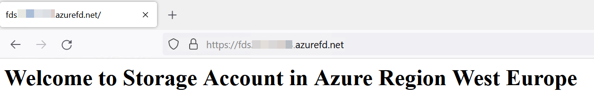

  In this case, the closest storage account is in the Azure region West Europe.
  The backend pool ("Backend-Storage") was configured to connect to the location with the lowest latency.

  Next step is to take a closer look at the request that reaches the backend. To do so, we're connecting again to our Azure FrontDoor instance, but this time, we're connecting to the closest webserver instance, instead of the closest storage. As you may remember, initially we created three webserver running in different Azure regions (West Europe, Central US and South East Asia). The webserver can be reached via : https://AzureFrontDoorCNAME/webserver.

  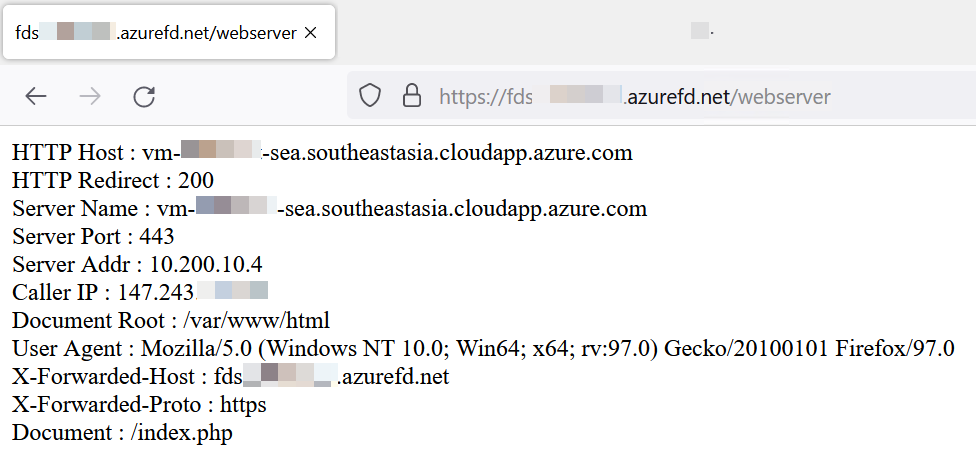

  The output should look similar to the one above.
  There are several variables shown, let me explain the most important ones.

  | Output Variable | Description |
  --- | ---| 
  |HTTP Host| This is the HTTP server name. In this module it's directly available through the Internet
  |Server Port| Shows the port you've connected to, should be 80 (HTTP) or 443 (HTTPS)
  |Server Addr| Is the internal IP of the server (just FYI and later useful)
  |Caller IP| This is the IP of the client that initiated the connection
  |X-Forwarded-Host| This is showing the HTTP host header that contains the "calling" host, in this case you see the name of the FrontDoor Instance.
  |X-Forwarded-Proto| Shows the protocol type from the called request. Again, HTTP or HTTPS, but in this case the protocol that was called against FrontDoor.

  Besides the variables, let me explain what the output shows. <br/>
  You called the website "X-Forwarded-Host" using "X-Forwarded-Proto" from "Caller IP" and reached the "HTTP Host" on "Server Port".<br/>

  Make a note of the "HTTP Host" you'll need it in the next step.

  Next step is to call the backend server directly and compare it to the request that we did before.
  So go back to your VM and open the URL that you noted in the last step ("HTTP Host").  The output should look similar to this:

  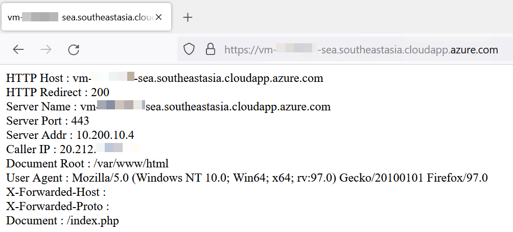

  What has changed ? <br />
  As you can see, "Caller IP" has changed and "X-Forwarded-Host" and "X-Forwarded-Proto" are empty. <br/>
  Since you called the Website directly, without FrontDoor in the middle, there's nothing in between that adds the appropriate HTTP headers and only "Caller IP" is shown.
  
  Now we're going to test performance improvements between FrontDoor and accessing the server directly.<br/>
  We don't have a large website running in this setup, so performance improvement is hard to measure. We're calling a script that does 50 times a curl and calculates and average response time in ms.<br/>
  Please paste the following commands in your local shell. If you're running Windows, you might need to install WSL(2) before you can issue the command. Be sure to change the FQDN in the command to your FrontDoor FQDN, followed by /webserver . The reason why we're using the /webserver path, is, because I want to reach the webserver instead of the storage account.

  A short note on Azure CloudShell : Of course you can use Azure CloudShell to run the commands below. But, there's a gotcha here. Since Azure CloudShell is running also in an Azure Region, it will also do the calls from the Azure Region it's located and thus, it could happen, that using FrontDoor in this specific szenario show "wrong" values.

  Direct connection to backend webserver:
  ```console
  for i in {1..50}; do echo -n "Run # $i :: "; curl -w 'Return Code: %{http_code}; Bytes received: %{size_download}; Response Time: %{time_total}\n' https://BACKEND-SERVER-FQDN -m 2 -o /dev/null -s; done|tee /dev/tty|awk '{ sum += $NF; n++ } END { if (n > 0) print "Average Resp time =",sum / n; }'
  ```
  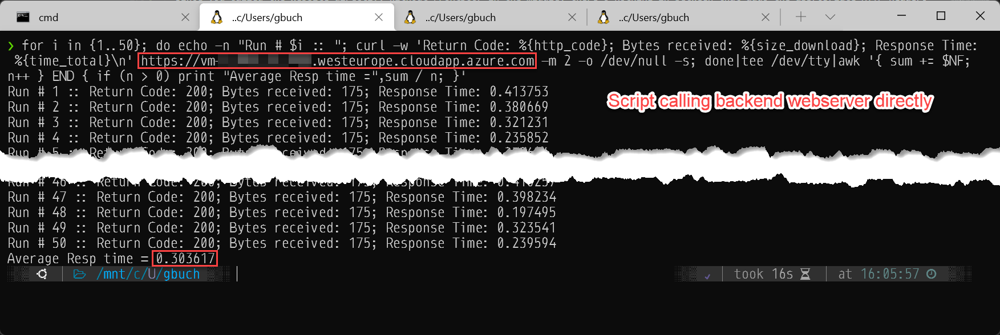</br>

  Connection to backend via Azure FrontDoor:
  ```console
  for i in {1..50}; do echo -n "Run # $i :: "; curl -w 'Return Code: %{http_code}; Bytes received: %{size_download}; Response Time: %{time_total}\n' https://YOURFRONTDOOR-FQDN/webserver -m 2 -o /dev/null -s; done|tee /dev/tty|awk '{ sum += $NF; n++ } END { if (n > 0) print "Average Resp time =",sum / n; }'
  ```
  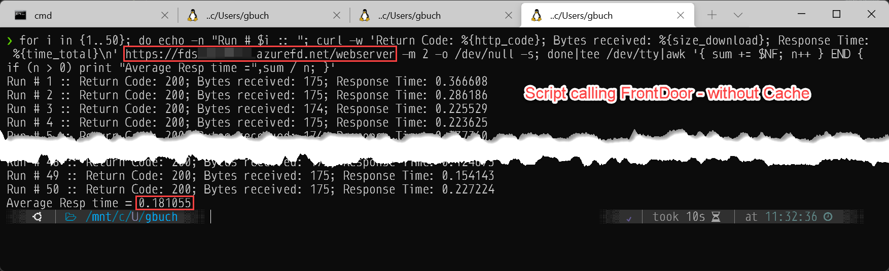</br>

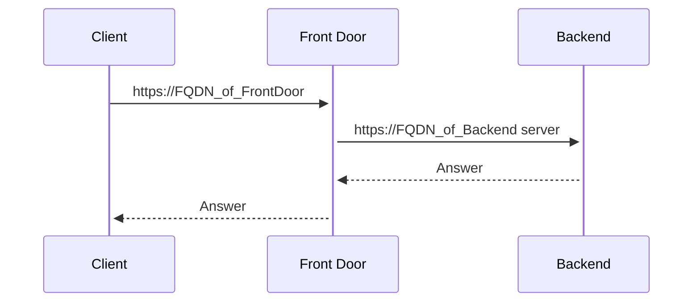


  Next step is to enable caching on the routing rule for the webserver backend.</br>
  Navigate to the routing rule configuration in the Azure FrontDoor Designer and open the "Webserver-Backend-1" rule.</br>
  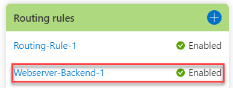</br>

  And enable the caching.</br>
  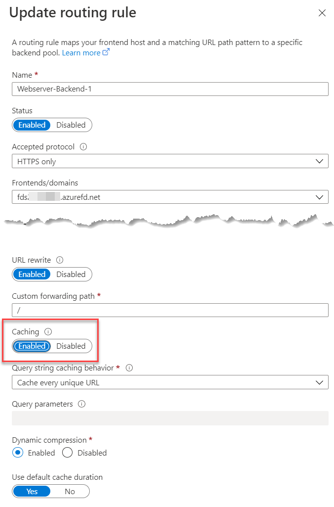</br>
  
  Save the configuration in the Azure FrontDoor Designer and wait a few minutes to let the settings synchronize.</br>
  Now run the script again and call the webserver via FrontDoor again:

  ```console
  for i in {1..50}; do echo -n "Run # $i :: "; curl -w 'Return Code: %{http_code}; Bytes received: %{size_download}; Response Time: %{time_total}\n' https://YOURFRONTDOOR-FQDN/webserver -m 2 -o /dev/null -s; done|tee /dev/tty|awk '{ sum += $NF; n++ } END { if (n > 0) print "Average Resp time =",sum / n; }'
  ```
  The result should look similar to this </br>
  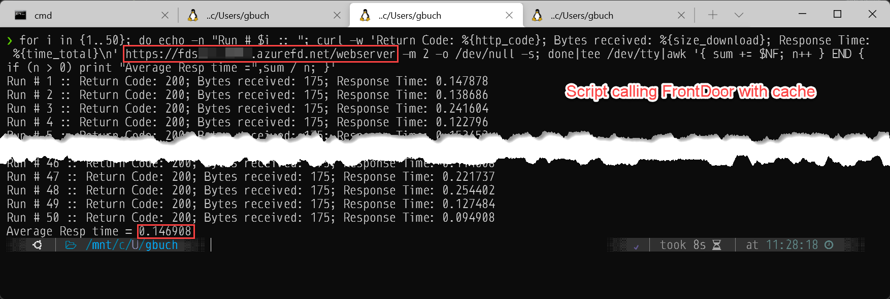</br>

  Let's collect results in a table and compare them:
  |Connection | Duration |
  --- | ---| 
  |Direct to backend | 0.303617 ms
  |Azure FrontDoor no Cache | 0.181055 ms
  |Azure FrontDoor with Cache | 0.146908 ms

  As you can see, Azure FrontDoor with enabled Cache improves the average response time ~ 50%.

  ## Module 5 : Rules Engine
  If you want to explore Azure FrontDoor on your own, now it's your turn.

  FrontDoor has a powerful rules engine to modify routing based on different conditions.
  Learn how to redirect requests from a certain IP to a different backend.

  So here's the small Challenge:</br>
  Implement a routing rule, that will route traffic from client in South East Asia (see variable : Virtual_Machine-SEA) directly to the Backend-Webserver without specifying /webserver path.

  This is what it looks like before you did the change:</br>
  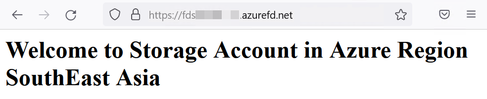</br>

  And after the change:</br>
  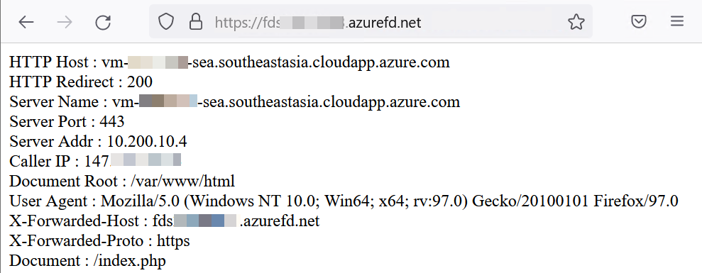</br>
  # STOP HERE if you want to try it on your own !</br>

  Otherwise, here's how you can solve the challenge.

  Under your FrontDoor resource, navigate to "Rules engine configuration".
  Create a new "Rules Engine" and add a new rule with the following settings:
  - add a conditition which matches the IP-Address of your client VM that you're using for testing.
  - add an action to forward the request to the "Backend-Webserver" pool </br>
  
  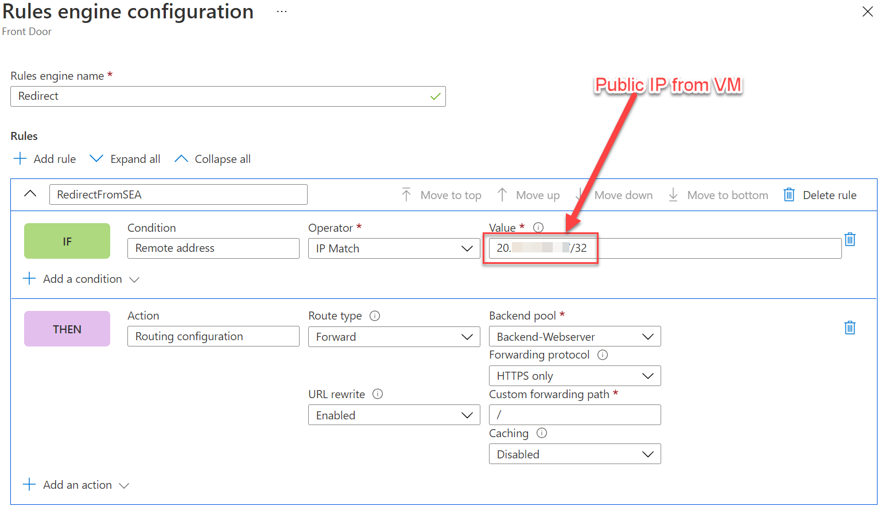</br>
  To activate the rule, you need to associate it with the appropriate routing rule. Since we want to redirect traffic that was originated on root path (/), we nneed to choose "Routing-Rule-1" </br>
  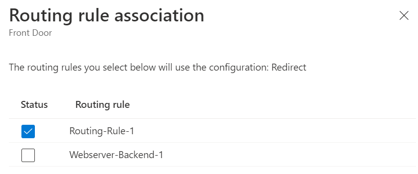 </br>
  If you browse now to the VM that we used before, you should see a similar output to the one shown at the beginning of the module.</br>

 # Closing : Clean up resources
After finishing the Microhack, you want to clean up your subscription to save costs.
Just go back to the console our cloudshell and issue the following command:
```console
terraform destroy
```
You might want to check that the resource group is deleted afterwards, if not, please delete it.


# +-+-+-+-+-+-+-+-+-+-+-+-+-+-+-+-+-+-+-+-+-+-+
You're leaving the "finish line". Everything below this line is work in progress.</br>
# +-+-+-+-+-+-+-+-+-+-+-+-+-+-+-+-+-+-+-+-+-+-+

In the next modules you're going to learn more on Azure FrontDoor Premium in combination with Private Link.

While you can secure the access to your backends based on different methods, they're either
- not "highly" secure (like using an NSG with FD IP Ranges) </br>
or
- based on L7, which needs additional configuration on your webserver</br>

# +-+-+-+-+-+-+-+-+-+-+-+-+-+-+-+-+-+-+-+-+-+-+

